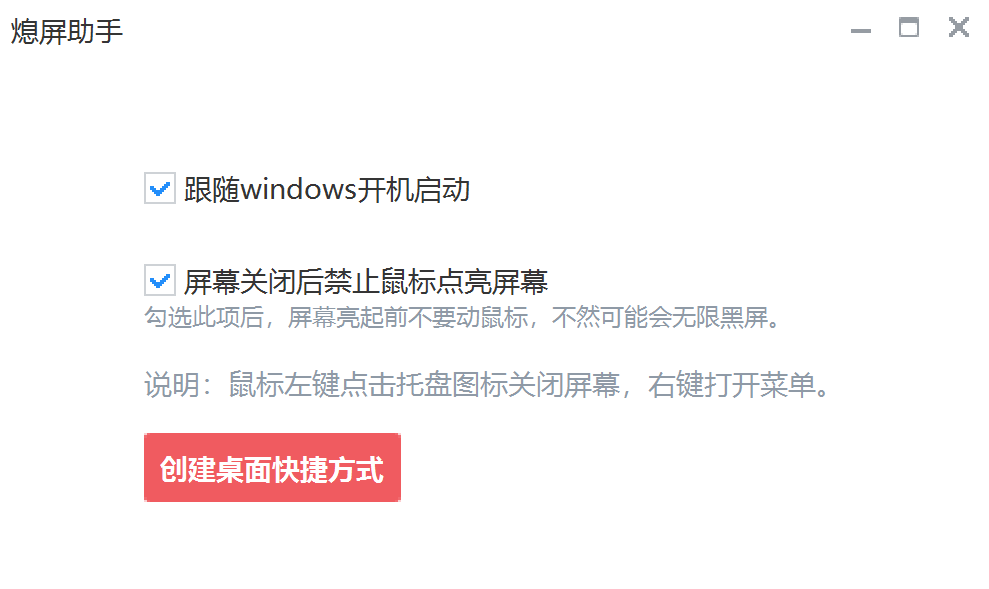

# 熄屏助手

主要是在公司午睡的时候不小心一下鼠标，屏幕就亮了，又不想关闭显示器电源，所以写了这个小工具，使用 [网易NIM Duilib](https://github.com/netease-im/NIM_Duilib_Framework) 开发，感谢NIM_Duilib_Framework和duilib开源项目

## 功能

 - 快捷关闭屏幕
 - 禁止鼠标乱动点亮屏幕

## 预览



## 编译

克隆项目到你的磁盘中

```bash
git clone https://github.com/l619534951/monitor_helper_duilib.git
```

进入 `monitor_helper_duilib/projects` 目录，使用 Visual Studio 2022 IDE 打开 `monitor_helper.sln`，按下 F7 即可编译所有示例程序

## 目录

├─`base` 基础类库  
├─`bin` 各个示例程序输出目录，包含预设的皮肤和语言文件以及 CEF 依赖
├─`duilib` duilib 核心代码，依赖 base 但不依赖 shared  
├─`libs` 静态库编译后的输出目录，包含预设的一些 CEF 组件静态库  
├─`projects` 主程序代码  
├─`third_party` 第三方库，目前仅有 cef_control 有依赖  
├─`ui_components` 基于 duilib 封装的常用组件库如 `msgbox`、`toast`、`cef_control` 等  

## 更多文档
[网易NIM Duilib](https://github.com/netease-im/NIM_Duilib_Framework)
[Duilib](https://github.com/duilib/duilib)

